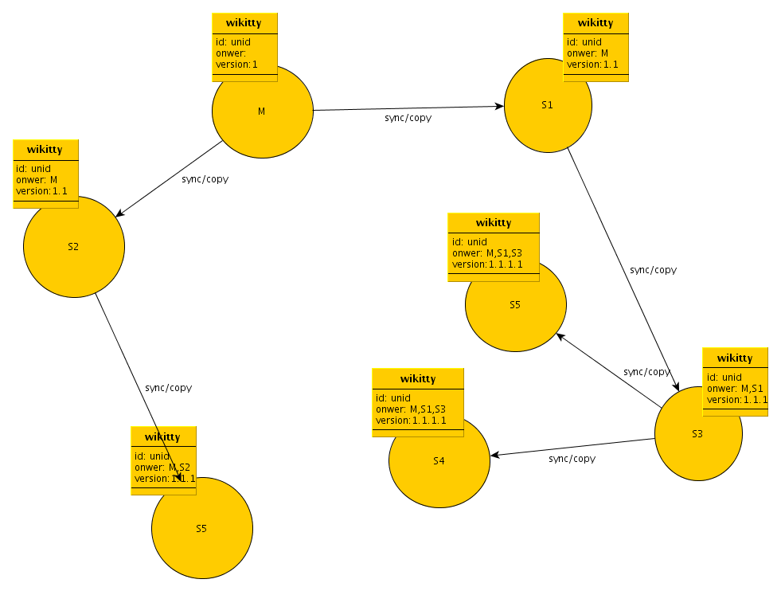

:Authors: Manoël Fortun

Specification pour une nouvelle gestion des versions des wikitty
----------------------------------------------------------------

Motivation
++++++++++

Dans le cadre de wikitty publication on peut synchroniser différent wikitty 
service, ce qui implique que l'on peut être amené à déployer des wikittys avec 
une version différente de 1.0 dans un autre wikitty service, qui lui n'ayant pas
de version de ce wikitty le repassera en version 1.0, rendant sa version 
obsolète d'office.

De plus deux wikitty service peuvent arriver à des numéros de version similaire
pour un même wikitty alors que ces deux wikitty auront été modifié chacun de 
leur coté, posant un problème quand à savoir quelle version doit être celle que
l'on doit prendre en compte.

Pour celà une solution proposée s'appuiera sur une notion de propriétaire de 
wikitty, et seul le propriétaire pourra changer la version majeur d'un wikitty. 

Solution
++++++++

Voici un diagramme qui montre une architecture de synchronisation entre wikitty.

On note l'apparition d'un champ owner dans les wikitty, il sert pour enregistrer
lors d'une synchronisation de quel wikitty service viens le wikitty.
On peut voir notre wikitty exemple qui à chaque synchronisation rempli le champ 
owneren ajoutant à la fin le dernier wikitty service propriétaire.
Dans ce champ on enregistrera l'id du wikitty service, id généré de la même
façon que pour un wikitty, on s'assurera ainsi une unicité. Cet id de service
drevra être stocker par le service dans sa base, pour un service sur file system
un nouvel id sera généré pour chaque espace de travail créé.

Le numéro de version change aussi, ainsi seul le propriétaire pourra changer la
version majeur du wikitty, et les autres wikitty service devront rajouter une 
version mineur à chaque nouveau niveau de transfert. Ce qui signifie que si un 
wikitty service récupère un wikitty qui à déja deux propriétaire, ce wikitty 
service rajoutera un 3ème "niveau" de version mineur, comme on le voit sur le 
schéma.

Lorsqu'un wikitty service recevra un wikitty, si il est dans la liste des 
propriétaires il vérifiera son numéro de version à lui, si il est inférieur à sa
version courante qu'il possède il ne fera rien du wikitty, sinon il regardera 
les versions mineur et mettra à jour sa propre version en incrémentant son 
numéro de version à lui.

Quelque soit le cas, pour un wikitty service il sait si il doit mettre à jour 
le wikitty uniquement si le numéro de version correspondant à son numéro de pair
(son ordre dans la liste des owners), n'est pas supérieur a la version actuel
du wikitty qu'il posséde en base, evidement celà pour numéro de version 
majeur egales.

Si un pair disparait, celà pose problème si plus d'un wikitty service ont reçu 
la même version d'un wikitty en même temps, par exemple on aurait ce problème 
sur le schéma si M disparait, puisque s1 et s2 ont reçu une version 1 du 
wikitty. Si leurs versions se rencontrent on ne pourra pas décider laquelle
va prévaloir. 
Même soucis si S3 disparait, on aurait un soucis sur la synchronisation entre 
S4 et S6, soucis pouvant être résolu en s'adressant à un pair encore
propriétaire soit S1 ici.

Dans le cas ou un pair disparait, si un seul wikitty a synchroniser des wikitty 
dont celui qui a disparut était le premier propriétaire, ce wikitty service 
deviens le premier owner symbooliquement.

Si on synchronise un wikitty entre un wikitty service en haut de chaine 
(de owners), et un en bas de chaine par exemple de M à S4, alors les owner
intervenant entre ces deux wikitty service sont ignoré et si on essayait 
d'envoyer une version 2 (de M) sur une version 1.2.3.5 (de S4) alors sur le 
wikitty service S4 la version sera maintenant 2.x et les "owners: M". 

Le seul soucis visible de cette solution pour le moment, est lors de la 
disparition d'un pair en début de chaine qui laisserais plusieurs pair fils au 
même niveau de owner, avec la même version majeur issu du owner précédent. 
Dans le cas ou le owner père est encore présent, une synchronisation avec 
celui ci déterminerait la version "vrai", en pratique, le premier arrivé. 

Pour ce genre de cas il faudrait un discriminant, rajouter quand on se rajoute 
en owner un entier qui serais équivalent au nombre de synchro concernant 
ce wikitty, donc incrémenté à chaque fois. C'est une solution qui nécessiterait 
de conserver trace du nombre de sync effectués sur un wikitty, assez lourd et 
pour un cas peut être isolé. On ne peut pas se fier aux dates, puisque un
wikitty service peut être sur un serveur où la date est faussée. 

Dans ce cas là on pourrait peut être envisager un algorithme de merge calculant 
les différences, ou il faut du coup les considérer comme deux wikitty différent,
dans ce cas.

Dans ce cas on se retrouve dans le même cas qu'avec une solution ou un wikitty 
service prendrait la version d'un wikitty si il ne le connait pas déja. 
Puisque en ce cas on a une collision si deux wikitty ont évolués chacun de leur
coté avec une version initiale identique. 

Possibilité qu'un wikitty service utilise comme référent la version de son
wikitty père. Dans un cas comme ça, en se servant des ancêtres commun, tout 
les cas sont résolus, mais ça créé une incompatibilité non résolvable entre
certain wikitty à partir du moment ou dans la chaine le père de tous n'est plus.
Ou pour reformuler dès lors ou le plus ancien ancêtre commun n'est plus.
